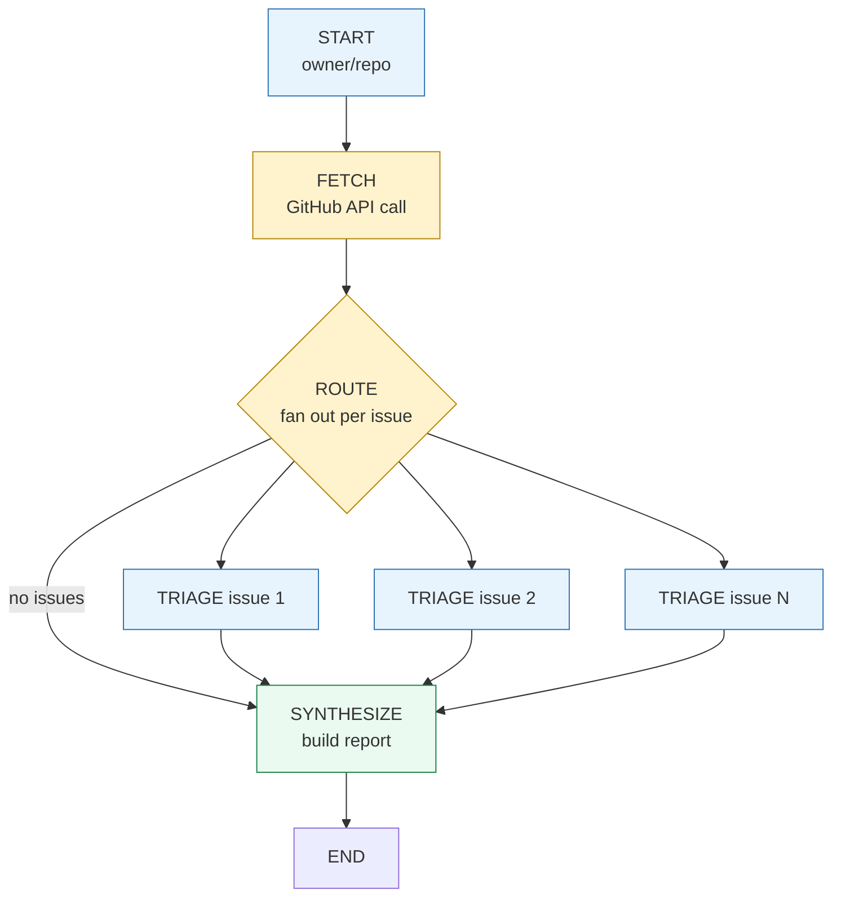
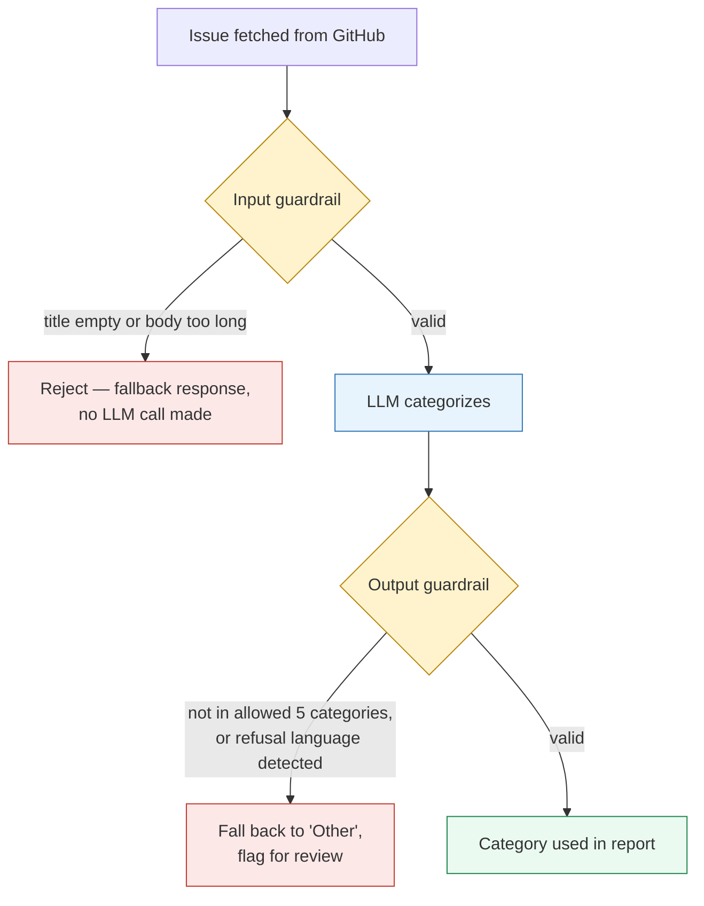
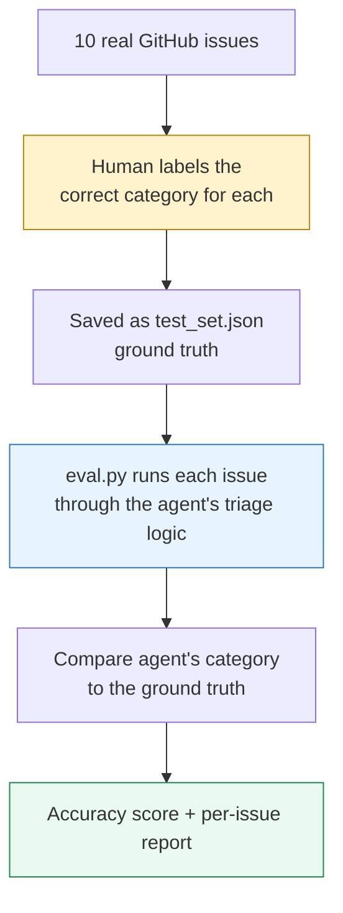
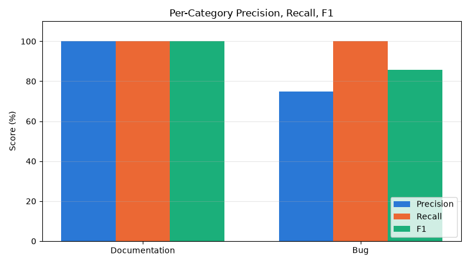
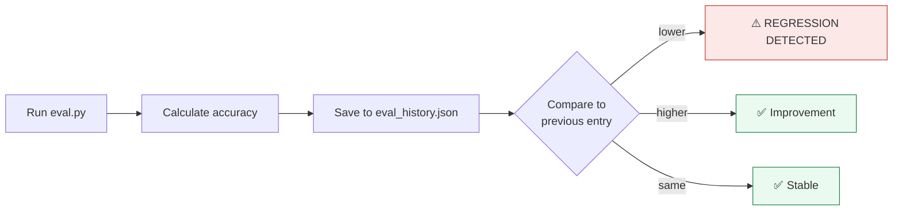
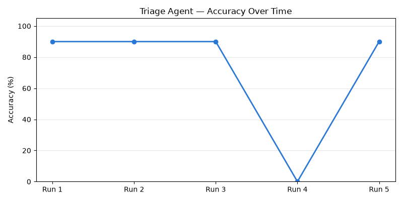

# GitHub Issue Triage Agent

A multi-step agent that fetches open issues from any public GitHub repo, **categorizes each one, and drafts a suggested response** — using LangGraph's parallel fan-out/fan-in pattern with checkpointing for crash recovery, and validated with an automated evaluation harness (90% accuracy on a labeled test set).

The agent never posts anything back to GitHub. It produces a report for a human to review — a deliberate **human-in-the-loop** design, not full automation.

---

## Contents

- [What it does](#what-it-does)
- [The graph](#the-graph)
- [How each node works](#how-each-node-works)
- [Parallel execution](#parallel-execution)
- [Checkpointing — crash recovery](#checkpointing-crash-recovery-and-a-real-bug-it-exposed)
- [Human-in-the-loop by design](#human-in-the-loop-by-design)
- [Guardrails](#guardrails)
- [Evaluation](#evaluation)
  - Per-category precision, recall, F1
  - LLM-as-judge with self-preference bias mitigation
  - Regression testing
  - Experiment tracking with MLflow
- [Setup](#setup)
- [Usage](#usage)
- [Project structure](#project-structure)
- [The progression](#the-progression)
- [What I learned](#what-i-learned)

---

## What it does

Give it any public repo. It fetches open issues, triages each one in parallel, and produces a structured report:

```
Enter a GitHub repo (owner/repo): psf/requests

  Fetched 5 issues from psf/requests
  [Triage] Issue #7574: Support for HTTP Query Method
  [Triage] Issue #7564: raise FileNotFoundError for missing TLS material
  [Triage] Issue #7547: Documentation suggestion: Add troubleshooting guidance...
  [Triage] Issue #7443: mypy warns about invalid types for json argument
  [Triage] Issue #7399: documentation for requests.session.request(verify=...)...

==================================================
GITHUB TRIAGE REPORT — psf/requests
==================================================
Summary: 1 Question, 1 Feature Request, 2 Documentation, 1 Bug

Issue #7574: Support for HTTP Query Method
  Category: Question
  Draft response: Thank you for bringing this up. While the requests library
  is currently feature-frozen, our maintainers are aware of the interest in
  supporting new HTTP methods like QUERY...

Issue #7564: raise FileNotFoundError for missing TLS material
  Category: Feature Request
  Draft response: Sure, changing OSError to FileNotFoundError can provide
  more clarity. We would accept a PR that updates the error type:
  ```
  if conn.cert_file and not os.path.exists(conn.cert_file):
      from errno import ENOENT
      raise FileNotFoundError(ENOENT, os.strerror(ENOENT), conn.cert_file)
  ```
...
```

Tested live against `psf/requests` (the popular Python HTTP library) — every fetched issue matched what's actually open on GitHub, and the draft responses engage with the real technical content, not generic boilerplate.

---

## The graph



Four nodes. The routing step handles two cases: fan out to parallel triage when issues exist, or skip straight to synthesize when the repo has no open issues or couldn't be accessed.

---

## How each node works

### Fetch node
Calls GitHub's public REST API (`/repos/{owner}/{repo}/issues`, no auth required for reasonable volume). Handles three real-world edge cases:

| Case | Response |
|------|----------|
| Repo doesn't exist (404) | Returns empty list, reported gracefully |
| Rate limited (403) | Returns empty list, logs the reason |
| Malformed input (no `/`) | Caught before the API call, clear error message |

A subtlety worth noting: GitHub's issues endpoint **also returns pull requests** — the API treats PRs as a type of issue. The fetch function filters these out (`if "pull_request" not in i`) and over-fetches (`limit * 4`) to compensate, since a chunk of any batch is typically PRs.

### Triage node (runs once per issue, in parallel)
For each issue, two LLM calls:
1. **Categorize** — Bug, Feature Request, Documentation, Question, or Other
2. **Draft response** — a specific, technically grounded reply (not generic boilerplate)

Wrapped in a try/except — if one issue's triage fails, it doesn't take down the other parallel branches; it returns a fallback "Unknown" category with a note instead.

### Synthesize node
Formats the triaged results into a readable report with a category summary. This node does **not** call the LLM — the structured data from triage speaks for itself, so formatting is pure Python.

---

## Parallel execution

Issues are triaged simultaneously using LangGraph's `Send()` fan-out pattern — the same technique used in [my planning agent](https://github.com/pratikb0501/planning-agent):

```python
def route_to_triage(state: TriageState):
    issues = state["issues"]
    if not issues:
        return "synthesize"
    return [Send("triage_one", {"issue": issue, "all_issues": issues}) for issue in issues]
```

Each parallel branch writes to a shared `triaged_issues` list. Since multiple branches write simultaneously, the state uses a **reducer** to concatenate results instead of overwriting:

```python
triaged_issues: Annotated[List[Dict], operator.add]
```

---

## Checkpointing — crash recovery (and a real bug it exposed)

State persists to `triage_checkpoints.db` after every node, using LangGraph's `SqliteSaver`. Each run gets an isolated save slot via a dynamically generated `thread_id`:

```python
run_id = uuid.uuid4().hex[:8]
thread_id = f"triage-{repo.replace('/', '-')}-{run_id}"
```

### A bug that evaluation caught

The first version keyed `thread_id` purely off the repo name (`f"triage-{repo}"`), with no per-run uniqueness. Since `triaged_issues` uses a reducer that only ever *appends* (`operator.add`), re-running the same repo reused the same checkpoint slot — each new run's results got appended on top of the previous run's, instead of starting fresh:

```
Run 1 on psf/requests: triaged_issues = [5 items]                    (saved)
Run 2 on psf/requests: LOADS 5 saved items, ADDS 5 new = 10 items    (saved)
Run 3 on psf/requests: LOADS 10 saved items, ADDS 5 new = 15 items   ← the bug
```

This surfaced while building the evaluation harness below — the report suddenly showed 15 categorizations for 5 fetched issues. **Building an eval script is what caught this**, not manual testing; running the agent casually a few times looked fine each time.

The fix: generate a unique `run_id` per invocation, so every run starts from a clean checkpoint slot while still keeping crash-recovery within a single run. This is a good example of why evaluation matters beyond just measuring accuracy — it also catches real correctness bugs that "it looked fine when I tried it" misses entirely.

---

## Human-in-the-loop by design

This agent deliberately **only reads** from GitHub (GET requests) — it never calls the authenticated POST/PATCH endpoints needed to actually post comments or close issues. The output is a report for a human maintainer to review, edit, and act on manually.

```
✅ Fetches issues (read-only)
✅ Categorizes and drafts responses
✅ Produces a structured report
❌ Never posts to GitHub automatically
❌ Never closes or labels issues automatically
```

This is a deliberate scope decision, not a limitation — automating triage suggestions is valuable; automating actual repo changes without human review is a different (and riskier) product.

---

## Guardrails

Input and output validation sit as a layer around every LLM call — not scattered ad-hoc checks, but consistent validation before the model sees data and before its response is trusted downstream.



### Input guardrail — caught a real case on live data

Checks title presence and body length (max 5,000 characters) before any LLM call is made. Running against `psf/requests`, this fired naturally — not in a staged test:

```
[Guardrail] Issue #7357 rejected: Issue body exceeds 5000 characters (6067)
```

Issue #7357 ("Localization of The Requests Documentation") has an unusually long body. The guardrail rejected it before spending a token, returning a clear fallback instead of sending an oversized payload to the model.

### Output guardrail — closes a gap evaluation exposed reactively

Validates that the returned category is exactly one of the five allowed values, and screens for refusal language. This directly targets the failure mode discovered during [Week 9's regression testing](#regression-testing): a broken prompt once caused the model to return full explanatory sentences instead of a clean category label, silently corrupting the eval score.

```python
validate_category_output(
    "Based on the title, I would categorize this as a Bug since it indicates an error."
)
# → valid=False, category="Other"
```

The same failure mode is now caught at the point of generation, automatically, rather than requiring an eval run to notice the score had crashed:

```
BEFORE guardrails: broken prompt → free-text output → eval score silently drops to 0%
                   → discovered only by re-running eval.py and noticing the drop

AFTER guardrails:  broken prompt → free-text output →
                   [Guardrail] Invalid category output → falls back to 'Other'
                   → caught in real time, doesn't propagate downstream
```

---

## Evaluation

Rather than eyeballing outputs, this agent has an automated evaluation harness that measures categorization accuracy against a human-labeled test set.

### How it works



1. **Built a labeled test set** — 10 real issues from `psf/requests`, each manually assigned the correct category (Bug / Feature Request / Documentation / Question / Other), independent of and before seeing the agent's output
2. **`eval.py`** runs the exact same `triage_one_node` function the live agent uses — no duplicated logic — against each test set item
3. Compares the agent's category to the labeled ground truth and reports per-issue pass/fail plus an overall accuracy score

### Result

```
$ python eval.py

EVALUATION REPORT
============================================================
Accuracy: 9/10 (90.0%)

✅ #7574: Support for HTTP Query Method
   Expected: Feature Request  |  Actual: Feature Request
❌ #7564: raise FileNotFoundError for missing TLS material
   Expected: Feature Request  |  Actual: Bug
✅ #7547: Documentation suggestion...
   Expected: Documentation    |  Actual: Documentation
...
FINAL SCORE: 90.0%
```

### An honest finding: non-determinism (found, diagnosed, and fixed)

Initial testing showed the eval score bouncing between runs on the *same* test set — not in overall accuracy (always ~90%), but in *which specific issue* failed. Issue #7574 and #7223 each flipped categories across different runs.

**Diagnosis:** the categorization LLM call ran at Ollama's default temperature (not 0), so borderline issues could be classified differently each time.

**Fix:** added a second, deterministic LLM client used only for categorization, while the response-drafting call keeps its default temperature (some wording variation there is harmless):

```python
llm = ChatOllama(model="qwen2.5:7b")                                # drafting
llm_deterministic = ChatOllama(model="qwen2.5:7b", temperature=0)   # categorization
```

**Verified fix — three consecutive runs, identical results:**

```
Run 1: 9/10 (90.0%) — ❌ #7564 raise FileNotFoundError for missing TLS material
Run 2: 9/10 (90.0%) — ❌ #7564 raise FileNotFoundError for missing TLS material
Run 3: 9/10 (90.0%) — ❌ #7564 raise FileNotFoundError for missing TLS material
```

Identical accuracy and identical failure case across all three runs — categorization is now fully deterministic. The one remaining miss (#7564) is now a stable, reproducible disagreement rather than noise, which makes it worth actually investigating: the user proposes a specific code change (leaning Feature Request), but the agent may be pattern-matching on words like "error" and "missing" toward Bug. That's a legitimate prompt-refinement target for a future iteration — not something worth chasing before the fix, since it wasn't even the same failure twice.

### Why this matters

This eval script drove a complete engineering cycle: measure → find a problem → diagnose → fix → re-measure to confirm:
1. Gave a **reproducible, quotable accuracy number** (90% on a 10-issue set) instead of a vague impression
2. **Caught a real bug** — the checkpoint accumulation issue described above — because the report showed an impossible number of categorizations for the fetched issue count
3. **Surfaced non-determinism** as a measurable property, diagnosed it to the temperature setting, and **verified the fix with three repeated runs** producing identical results

### Beyond accuracy: per-category precision, recall, F1

A single accuracy number hides where a classifier is actually strong or weak — especially on an imbalanced test set like this one (6 Documentation vs. 3 Bug vs. 1 Feature Request). Breaking the same 10-issue result down per category:

| Category | Precision | Recall | F1 |
|---|---|---|---|
| Documentation | 100% (5/5) | 100% (5/5) | 100% |
| Bug | 75% (3/4) | 100% (3/3) | 85.7% |



**Documentation: perfect** — every claim correct, every real Documentation issue found.

**Bug: never misses a real bug (100% recall), but occasionally over-calls it** when the true label was Feature Request (one false positive, issue #7564, bringing precision to 75%). A "Bug" label from this agent is trustworthy for not missing anything, but worth a second glance before auto-escalating.

```
Precision (Bug) = TP / (TP + FP) = 3 / 4 = 75%
Recall (Bug)    = TP / (TP + FN) = 3 / 3 = 100%
F1 (Bug)        = 2 × (0.75 × 1.00) / (0.75 + 1.00) = 85.7%
```

---

### Evaluating the draft responses: LLM-as-judge

Categorization has a clean ground truth to compare against. The **drafted responses** don't — there's no single "correct" wording, so precision/recall doesn't apply. Instead, `judge_eval.py` uses a second LLM call to score each draft on three criteria (professional, relevant, concise), 1-5 each.

**Known limitation, stated honestly:** the judge uses the same model (`qwen2.5:7b`) that generated the responses, which carries documented self-preference bias risk — a model tends to rate its own outputs more favorably than an independent model would. Two mitigations are in place: the judge runs at `temperature=0` (same fix as categorization), and a **sanity check runs before every evaluation** to confirm the judge actually discriminates between quality levels rather than defaulting to a fixed score:

```
Judge sanity check
  Bad response ("lol idk sounds like a you problem"):
    professional: 2/5, relevant: 1/5, concise: 2/5
  Good response ("Thank you for reporting... share your OS version"):
    professional: 4/5, relevant: 3/5, concise: 2/5
  ✅ Judge correctly scored the bad response lower — discriminates properly
```

This check matters: early testing showed "Professional" scoring exactly 4/5 across every single real response with zero variation, which looked suspicious — either the responses are genuinely that consistent, or the judge wasn't discriminating at all. Injecting a deliberately bad response resolved it: the judge dropped "professional" to 2/5 for the bad one, confirming the consistent 4/5 on real outputs reflects genuine, consistent quality rather than a lazy judge.

**Results on the 10-issue test set** (professional / relevant / concise, each out of 5):

| Metric | Typical range |
|---|---|
| Professional | 4/5 (consistent) |
| Relevant | 3-5/5 |
| Concise | 2-4/5 |

"Concise" is the weakest and most variable dimension — several draft responses run longer than necessary, which is a legitimate target for prompt refinement (e.g. adding an explicit length constraint to the drafting prompt).

---

### Regression testing

Every `eval.py` run saves its score to `eval_history.json` with a timestamp, then automatically compares against the previous run — catching the exact failure mode of "I changed something and forgot what the score used to be."



**Tested against both directions** — deliberately broke the categorization prompt (removed the "return only the category word" constraint), confirming the system catches degradation, then reverted it to confirm recovery is detected too:

```
Baseline:              90.0% → 90.0%  → ✅ No change — score is stable
Deliberately broken:   90.0% → 0.0%   → ⚠️ REGRESSION DETECTED: dropped 90.0 points
Reverted:               0.0% → 90.0%  → ✅ Improvement: increased 90.0 points
```

`dashboard.py` renders this same history as a chart (`accuracy_trend.png`), generated directly from `eval_history.json`:



The broken-prompt test also revealed something beyond category accuracy: without the explicit "return only the category word" instruction, the model returned full explanatory sentences instead of a clean label — so the eval script is implicitly testing **output format compliance**, not just categorization correctness. A prompt change that breaks the expected output shape gets caught exactly as reliably as one that breaks the reasoning.

---

### Experiment tracking with MLflow

The JSON-based history above tracks *scores* but not the *configuration* that produced them — if the model, temperature, or prompt changes between runs, there's no record of which combination produced which result. MLflow logs both together.

Every `eval.py` run logs to MLflow:

```
PARAMETERS (the configuration):
  model = "qwen2.5:7b"
  temperature = 0
  test_set_size = 10

METRICS (the results):
  accuracy = 90.0
  precision_bug, recall_bug, f1_bug
  precision_documentation, recall_documentation, f1_documentation
  precision_feature_request, recall_feature_request, f1_feature_request
  (per-category metrics computed automatically for every category
   present in the test set, not hand-typed)

ARTIFACTS:
  test_set.json (the exact ground truth used, for full reproducibility)
```

Unlike the hand-calculated Day 2 numbers, these per-category metrics are now computed by `calculate_category_metrics()` fresh on every run — including "Feature Request," a category the manual Day 2 pass didn't cover.

Run locally:
```bash
mlflow ui --backend-store-uri sqlite:///mlflow.db
```

This opens a queryable web UI where every run is a row — sortable and filterable by any parameter or metric, with side-by-side comparison between any two runs. That's the practical upgrade over static JSON + PNG: instead of re-reading a chart, you can ask "show me every run where temperature=0, sorted by Bug F1" directly in the UI.

---


| Component | Choice |
|-----------|--------|
| Orchestration | LangGraph (StateGraph, Send fan-out, conditional edges) |
| Persistence | langgraph-checkpoint-sqlite |
| LLM | qwen2.5:7b (Ollama, local) |
| GitHub access | requests (public REST API, no auth) |

Runs **fully local and free**.

---

## Setup

```bash
ollama pull qwen2.5:7b
pip install langgraph langchain-ollama requests langgraph-checkpoint-sqlite mlflow matplotlib
python agent.py
```

## Usage

Run the agent live:
```
python agent.py
Enter a GitHub repo (owner/repo): psf/requests
```

Run the evaluation harness against the labeled test set (also logs to MLflow):
```
python eval.py
```

View tracked experiment runs:
```
mlflow ui --backend-store-uri sqlite:///mlflow.db
```

Generate the accuracy trend and category breakdown charts from eval history:
```
python dashboard.py
```

Works on any public repo. Tested against `psf/requests` (146 open issues at time of testing, 5-10 fetched per run).

---

## Project structure

```
.
├── agent.py                  # the full triage agent
├── eval.py                   # categorization accuracy harness + regression testing + MLflow logging
├── judge_eval.py             # LLM-as-judge for draft response quality
├── dashboard.py               # renders eval_history.json as trend + category charts
├── test_set.json             # human-labeled ground truth (10 issues)
├── eval_history.json         # timestamped score history for regression detection
├── accuracy_trend.png        # generated chart, committed so it renders in this README
├── category_breakdown.png    # generated chart, committed so it renders in this README
├── mlflow.db                 # MLflow SQLite tracking backend (gitignored)
├── triage_checkpoints.db     # SQLite checkpoint store (gitignored)
└── README.md
```

---

## The progression

| Project | What it demonstrates |
|---------|---------------------|
| [Bare-metal Agent](https://github.com/pratikb0501/Bare-metal-ReAct-agent) | ReAct loop — variable steps, one question at a time |
| [Planning Agent](https://github.com/pratikb0501/planning-agent) | Multi-step goal decomposition, checkpointing, parallel research |
| **GitHub Triage Agent** (this repo) | Real external API integration, parallel triage at scale, human-in-the-loop design, **evaluation harness with measured accuracy** |

---

## What I learned

- Integrating a real external API (GitHub REST) into an agent pipeline, including handling its quirks (PRs mixed into the issues endpoint)
- Reusing the fan-out/fan-in parallel pattern for a genuinely useful, non-toy task
- Designing human-in-the-loop as a first-class architectural decision, not an afterthought — the agent's read-only scope is deliberate
- Defensive error handling at multiple layers: malformed input, API errors, and per-branch LLM failures that don't crash the whole batch
- Checkpointing with per-run unique thread IDs, and specifically *why* naive repo-based thread IDs caused a silent data accumulation bug
- Building a labeled test set and an automated evaluation harness — replacing "it looks right" with a reproducible accuracy number
- Evaluation isn't just for measuring quality — the eval harness directly caught a real correctness bug that casual manual testing had missed across several runs
- LLM non-determinism is real and measurable — diagnosed via repeated eval runs showing different specific failures on the same test set, fixed by adding a separate temperature=0 client for the classification call, and verified with three consecutive identical eval runs
- Per-category precision, recall, and F1 reveal failure modes that a single accuracy number hides — my Bug category has a false-positive problem (75% precision) but zero false negatives (100% recall), which is a specific, actionable finding versus a vague "90% accurate"
- LLM-as-judge for evaluating open-ended output (draft responses) that has no single correct answer to compare against — and why it needs its own validation, not blind trust
- Same-model judging carries self-preference bias risk; I mitigated this with temperature=0 and, more importantly, built a sanity check (deliberately bad vs. good response) that runs before every evaluation to confirm the judge actually discriminates rather than defaulting to a fixed score
- Regression testing — persisting every eval score with a timestamp and automatically comparing against the previous run — turns "did my change help or hurt?" from a guess into an automatic, verified answer. Tested by deliberately breaking a prompt (90% → 0%, correctly flagged) and reverting it (0% → 90%, correctly flagged as improvement)
- Turning eval history into a chart makes the same regression story readable at a glance — a single trend line communicates "tested, broken on purpose, recovered" faster than reading the raw log
- MLflow closes the biggest gap in the hand-rolled tracking: JSON history recorded scores but never the configuration (model, temperature) that produced them. Logging both together, plus per-category metrics computed automatically instead of hand-typed, makes every historical result traceable and queryable through a real UI instead of re-reading static files
- Guardrails as a consistent layer (validate before the LLM call, validate after) rather than scattered checks — the input guardrail caught a real oversized issue on live data, and the output guardrail closes, proactively, the exact failure mode Week 9's regression testing had only caught reactively after the score already crashed