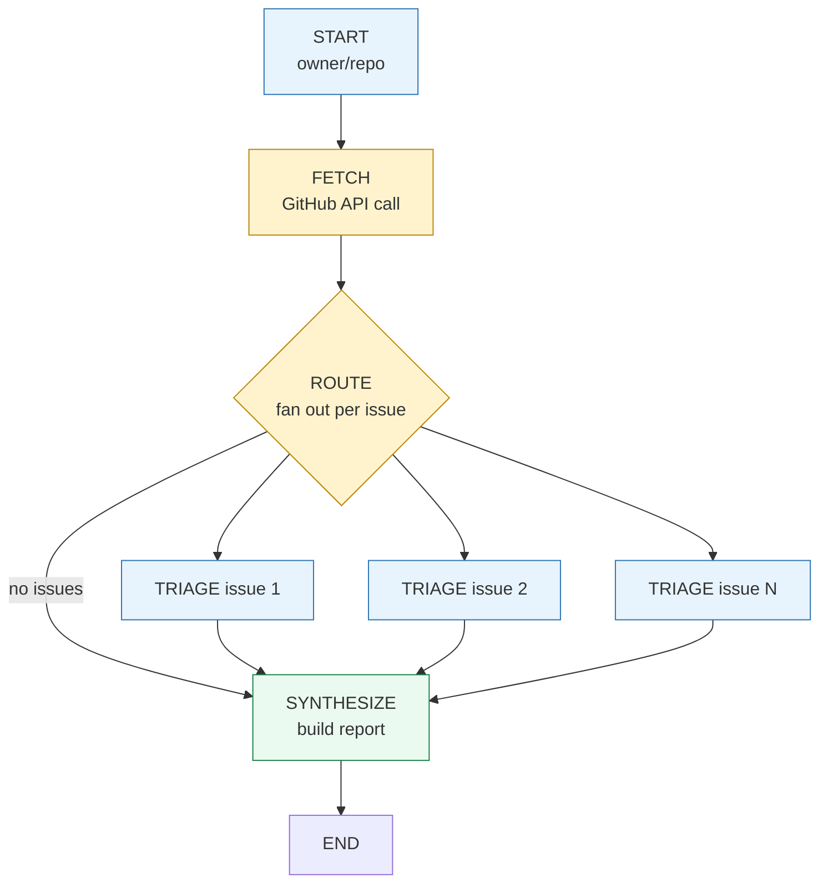
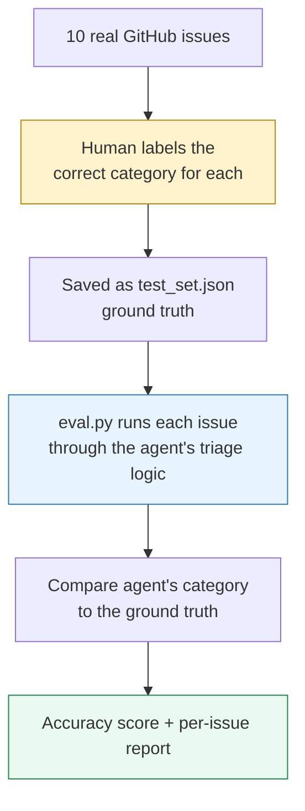

# GitHub Issue Triage Agent

A multi-step agent that fetches open issues from any public GitHub repo, **categorizes each one, and drafts a suggested response** — using LangGraph's parallel fan-out/fan-in pattern with checkpointing for crash recovery, and validated with an automated evaluation harness (90% accuracy on a labeled test set).

The agent never posts anything back to GitHub. It produces a report for a human to review — a deliberate **human-in-the-loop** design, not full automation.

---

## What it does

Give it any public repo. It fetches open issues, triages each one in parallel, and produces a structured report:

```
Enter a GitHub repo (owner/repo): psf/requests

  Fetched 5 issues from psf/requests
  [Triage] Issue #7574: Support for HTTP Query Method
  [Triage] Issue #7564: raise FileNotFoundError for missing TLS material
  [Triage] Issue #7547: Documentation suggestion: Add troubleshooting guidance...
  [Triage] Issue #7443: mypy warns about invalid types for json argument
  [Triage] Issue #7399: documentation for requests.session.request(verify=...)...

==================================================
GITHUB TRIAGE REPORT — psf/requests
==================================================
Summary: 1 Question, 1 Feature Request, 2 Documentation, 1 Bug

Issue #7574: Support for HTTP Query Method
  Category: Question
  Draft response: Thank you for bringing this up. While the requests library
  is currently feature-frozen, our maintainers are aware of the interest in
  supporting new HTTP methods like QUERY...

Issue #7564: raise FileNotFoundError for missing TLS material
  Category: Feature Request
  Draft response: Sure, changing OSError to FileNotFoundError can provide
  more clarity. We would accept a PR that updates the error type:
  ```
  if conn.cert_file and not os.path.exists(conn.cert_file):
      from errno import ENOENT
      raise FileNotFoundError(ENOENT, os.strerror(ENOENT), conn.cert_file)
  ```
...
```

Tested live against `psf/requests` (the popular Python HTTP library) — every fetched issue matched what's actually open on GitHub, and the draft responses engage with the real technical content, not generic boilerplate.

---

## The graph



Four nodes. The routing step handles two cases: fan out to parallel triage when issues exist, or skip straight to synthesize when the repo has no open issues or couldn't be accessed.

---

## How each node works

### Fetch node
Calls GitHub's public REST API (`/repos/{owner}/{repo}/issues`, no auth required for reasonable volume). Handles three real-world edge cases:

| Case | Response |
|------|----------|
| Repo doesn't exist (404) | Returns empty list, reported gracefully |
| Rate limited (403) | Returns empty list, logs the reason |
| Malformed input (no `/`) | Caught before the API call, clear error message |

A subtlety worth noting: GitHub's issues endpoint **also returns pull requests** — the API treats PRs as a type of issue. The fetch function filters these out (`if "pull_request" not in i`) and over-fetches (`limit * 4`) to compensate, since a chunk of any batch is typically PRs.

### Triage node (runs once per issue, in parallel)
For each issue, two LLM calls:
1. **Categorize** — Bug, Feature Request, Documentation, Question, or Other
2. **Draft response** — a specific, technically grounded reply (not generic boilerplate)

Wrapped in a try/except — if one issue's triage fails, it doesn't take down the other parallel branches; it returns a fallback "Unknown" category with a note instead.

### Synthesize node
Formats the triaged results into a readable report with a category summary. This node does **not** call the LLM — the structured data from triage speaks for itself, so formatting is pure Python.

---

## Parallel execution

Issues are triaged simultaneously using LangGraph's `Send()` fan-out pattern — the same technique used in [my planning agent](https://github.com/pratikb0501/planning-agent):

```python
def route_to_triage(state: TriageState):
    issues = state["issues"]
    if not issues:
        return "synthesize"
    return [Send("triage_one", {"issue": issue, "all_issues": issues}) for issue in issues]
```

Each parallel branch writes to a shared `triaged_issues` list. Since multiple branches write simultaneously, the state uses a **reducer** to concatenate results instead of overwriting:

```python
triaged_issues: Annotated[List[Dict], operator.add]
```

---

## Checkpointing — crash recovery (and a real bug it exposed)

State persists to `triage_checkpoints.db` after every node, using LangGraph's `SqliteSaver`. Each run gets an isolated save slot via a dynamically generated `thread_id`:

```python
run_id = uuid.uuid4().hex[:8]
thread_id = f"triage-{repo.replace('/', '-')}-{run_id}"
```

### A bug that evaluation caught

The first version keyed `thread_id` purely off the repo name (`f"triage-{repo}"`), with no per-run uniqueness. Since `triaged_issues` uses a reducer that only ever *appends* (`operator.add`), re-running the same repo reused the same checkpoint slot — each new run's results got appended on top of the previous run's, instead of starting fresh:

```
Run 1 on psf/requests: triaged_issues = [5 items]                    (saved)
Run 2 on psf/requests: LOADS 5 saved items, ADDS 5 new = 10 items    (saved)
Run 3 on psf/requests: LOADS 10 saved items, ADDS 5 new = 15 items   ← the bug
```

This surfaced while building the evaluation harness below — the report suddenly showed 15 categorizations for 5 fetched issues. **Building an eval script is what caught this**, not manual testing; running the agent casually a few times looked fine each time.

The fix: generate a unique `run_id` per invocation, so every run starts from a clean checkpoint slot while still keeping crash-recovery within a single run. This is a good example of why evaluation matters beyond just measuring accuracy — it also catches real correctness bugs that "it looked fine when I tried it" misses entirely.

---

## Human-in-the-loop by design

This agent deliberately **only reads** from GitHub (GET requests) — it never calls the authenticated POST/PATCH endpoints needed to actually post comments or close issues. The output is a report for a human maintainer to review, edit, and act on manually.

```
✅ Fetches issues (read-only)
✅ Categorizes and drafts responses
✅ Produces a structured report
❌ Never posts to GitHub automatically
❌ Never closes or labels issues automatically
```

This is a deliberate scope decision, not a limitation — automating triage suggestions is valuable; automating actual repo changes without human review is a different (and riskier) product.

---

## Evaluation — Project #3

Rather than eyeballing outputs, this agent has an automated evaluation harness that measures categorization accuracy against a human-labeled test set.

### How it works



1. **Built a labeled test set** — 10 real issues from `psf/requests`, each manually assigned the correct category (Bug / Feature Request / Documentation / Question / Other), independent of and before seeing the agent's output
2. **`eval.py`** runs the exact same `triage_one_node` function the live agent uses — no duplicated logic — against each test set item
3. Compares the agent's category to the labeled ground truth and reports per-issue pass/fail plus an overall accuracy score

### Result

```
$ python eval.py

EVALUATION REPORT
============================================================
Accuracy: 9/10 (90.0%)

✅ #7574: Support for HTTP Query Method
   Expected: Feature Request  |  Actual: Feature Request
❌ #7564: raise FileNotFoundError for missing TLS material
   Expected: Feature Request  |  Actual: Bug
✅ #7547: Documentation suggestion...
   Expected: Documentation    |  Actual: Documentation
...
FINAL SCORE: 90.0%
```

### An honest finding: non-determinism (found, diagnosed, and fixed)

Initial testing showed the eval score bouncing between runs on the *same* test set — not in overall accuracy (always ~90%), but in *which specific issue* failed. Issue #7574 and #7223 each flipped categories across different runs.

**Diagnosis:** the categorization LLM call ran at Ollama's default temperature (not 0), so borderline issues could be classified differently each time.

**Fix:** added a second, deterministic LLM client used only for categorization, while the response-drafting call keeps its default temperature (some wording variation there is harmless):

```python
llm = ChatOllama(model="qwen2.5:7b")                                # drafting
llm_deterministic = ChatOllama(model="qwen2.5:7b", temperature=0)   # categorization
```

**Verified fix — three consecutive runs, identical results:**

```
Run 1: 9/10 (90.0%) — ❌ #7564 raise FileNotFoundError for missing TLS material
Run 2: 9/10 (90.0%) — ❌ #7564 raise FileNotFoundError for missing TLS material
Run 3: 9/10 (90.0%) — ❌ #7564 raise FileNotFoundError for missing TLS material
```

Identical accuracy and identical failure case across all three runs — categorization is now fully deterministic. The one remaining miss (#7564) is now a stable, reproducible disagreement rather than noise, which makes it worth actually investigating: the user proposes a specific code change (leaning Feature Request), but the agent may be pattern-matching on words like "error" and "missing" toward Bug. That's a legitimate prompt-refinement target for a future iteration — not something worth chasing before the fix, since it wasn't even the same failure twice.

### Why this matters

This eval script drove a complete engineering cycle: measure → find a problem → diagnose → fix → re-measure to confirm:
1. Gave a **reproducible, quotable accuracy number** (90% on a 10-issue set) instead of a vague impression
2. **Caught a real bug** — the checkpoint accumulation issue described above — because the report showed an impossible number of categorizations for the fetched issue count
3. **Surfaced non-determinism** as a measurable property, diagnosed it to the temperature setting, and **verified the fix with three repeated runs** producing identical results

---


| Component | Choice |
|-----------|--------|
| Orchestration | LangGraph (StateGraph, Send fan-out, conditional edges) |
| Persistence | langgraph-checkpoint-sqlite |
| LLM | qwen2.5:7b (Ollama, local) |
| GitHub access | requests (public REST API, no auth) |

Runs **fully local and free**.

---

## Setup

```bash
ollama pull qwen2.5:7b
pip install langgraph langchain-ollama requests langgraph-checkpoint-sqlite
python agent.py
```

## Usage

Run the agent live:
```
python agent.py
Enter a GitHub repo (owner/repo): psf/requests
```

Run the evaluation harness against the labeled test set:
```
python eval.py
```

Works on any public repo. Tested against `psf/requests` (146 open issues at time of testing, 5-10 fetched per run).

---

## Project structure

```
.
├── agent.py                  # the full triage agent
├── eval.py                   # automated evaluation harness
├── test_set.json             # human-labeled ground truth (10 issues)
├── triage_checkpoints.db     # SQLite checkpoint store (gitignored)
└── README.md
```

---

## The progression

| Project | What it demonstrates |
|---------|---------------------|
| [Bare-metal Agent](https://github.com/pratikb0501/Bare-metal-ReAct-agent) | ReAct loop — variable steps, one question at a time |
| [Planning Agent](https://github.com/pratikb0501/planning-agent) | Multi-step goal decomposition, checkpointing, parallel research |
| **GitHub Triage Agent** (this repo) | Real external API integration, parallel triage at scale, human-in-the-loop design, **evaluation harness with measured accuracy** |

---

## What I learned

- Integrating a real external API (GitHub REST) into an agent pipeline, including handling its quirks (PRs mixed into the issues endpoint)
- Reusing the fan-out/fan-in parallel pattern for a genuinely useful, non-toy task
- Designing human-in-the-loop as a first-class architectural decision, not an afterthought — the agent's read-only scope is deliberate
- Defensive error handling at multiple layers: malformed input, API errors, and per-branch LLM failures that don't crash the whole batch
- Checkpointing with per-run unique thread IDs, and specifically *why* naive repo-based thread IDs caused a silent data accumulation bug
- Building a labeled test set and an automated evaluation harness — replacing "it looks right" with a reproducible accuracy number
- Evaluation isn't just for measuring quality — the eval harness directly caught a real correctness bug that casual manual testing had missed across several runs
- LLM non-determinism is real and measurable — diagnosed via repeated eval runs showing different specific failures on the same test set, fixed by adding a separate temperature=0 client for the classification call, and verified with three consecutive identical eval runs
